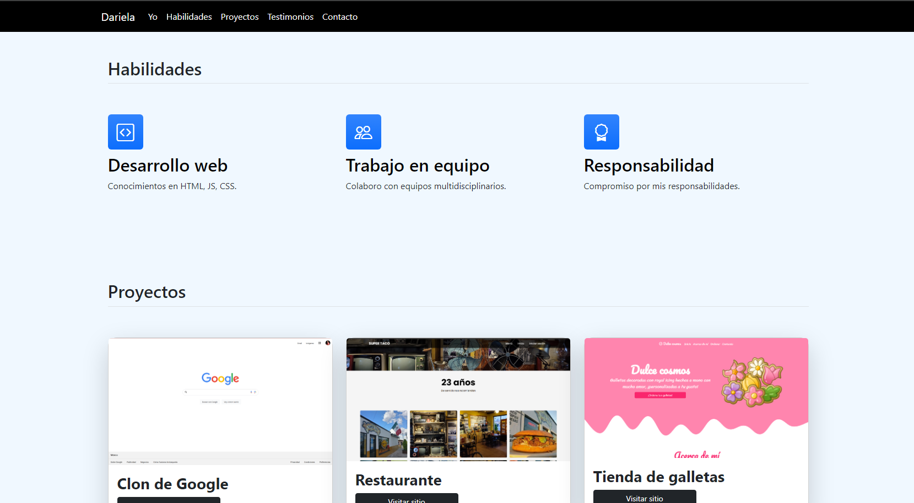
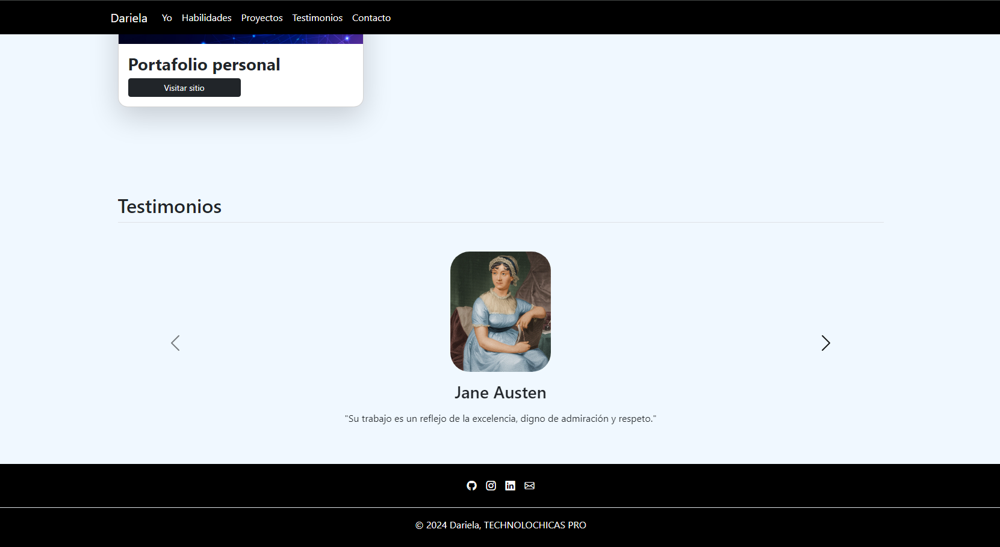

# Mi portafolio de habilidades TENCOLOCHICAS PRO

El presente proyecto es un portafolio desarrollado para poner en práctica las habilidades obtenidas dentro del bootcamp de desarrollo frontend de Tecnolochicas PRO.

Fue desarrollado con HTML, CSS y JS con el uso del framework de diseño UI, Bootstrap, utilizando además bibliotecas externas.

La página es responsiva (adaptable a diferentes tamaños de pantalla) e incluye la presentación de la autora del proyecto.

Proyecto desplegado https://dariela-garcia.netlify.app/

## Secciones de mi sitio

## Tecnologías

* HTML
* CSS
* Bootstrap
* JavaScript
---
## Desarrollado con amor <3 por [Dariela](https://github.com/DarielaGZ) en Tecnolochicas PRO